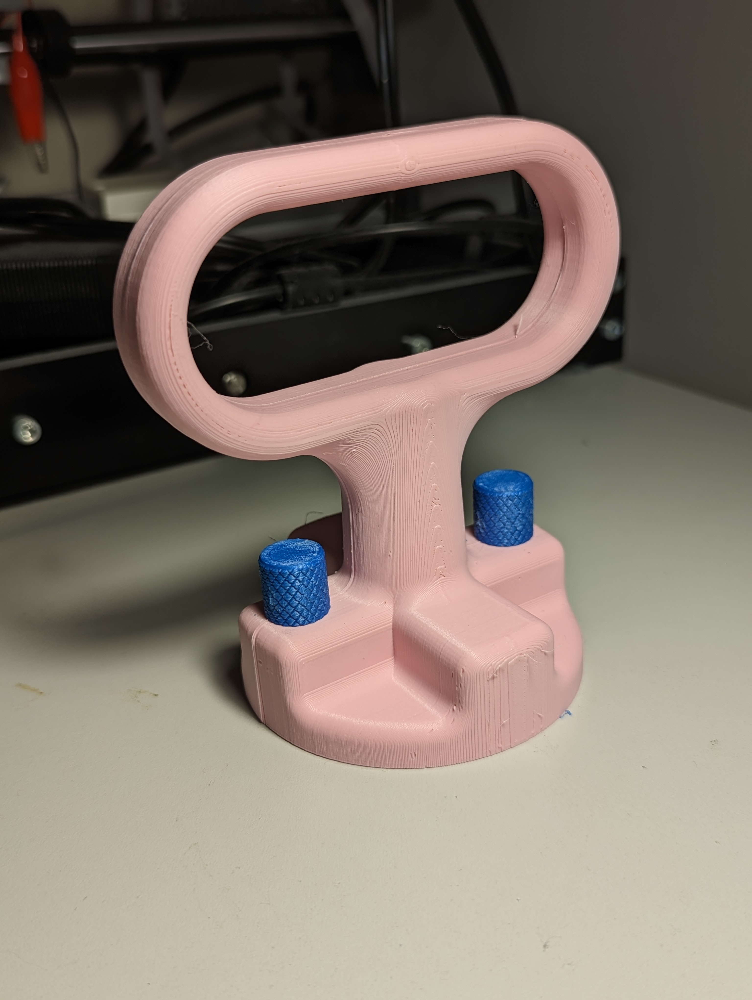

# Gas Cap Opener
The gas cap opener is a device designed to allow users with limited grip strength and hand function to easily open and close the gas cap on their vehicle.

## More info at
- [Makers Making Change Project Page](https://makersmakingchange.com/project/gas-cap-opener/)
- [Makers Making Change Forum Thread](https://makersmakingchange.com/forum/topic/gas-cap-opener/)

## How to Obtain a Gas Cap Opener
### 1. Do it Yourself (DIY) or Do it Together (DIT)

This is an open-source assistive technology, so anyone is free to build it. All of the files and instructions required to build the Gas Cap Opener are contained within this repository. Refer to the Maker Checklist below.

### 2. Request a build of this device

If you would like to obtain a Gas Cap Opener , you may submit a build request through the [MMC Library Page](https://makersmakingchange.com/project/gas-cap-opener/). The requestor is responsible for the cost of materials and any shipping.

### 3. How to build this device for someone else

If you have the skills and equipment to build this device, and would like to donate your time to create the switch for someone who needs it, visit the [MMC Maker Wanted](https://makersmakingchange.com/maker-wanted/) section.

## Getting Started

### 1. Read the Makers Checklist

The Makers Checklist 

### 2. Order the Off-The-Shelf Components

The [Bill of Materials](/Documentation/Gas_Cap_Opener_BOM_V1.0.xlsx) lists all of the parts and components required to build the Gas Cap Opener. 

### 3. Print the 3D Printable components

All of the files and individual print files can be in the [/Build_Files/3D_Printing_Files](/Build_Files/3D_Printing_Files/) folder.

### 4. Assemble the Gas Cap Opener

Reference the [Assembly Guide](/Documentation/Gas_Cap_Opener_Assembly_Guide_V1.0.pdf) for the tools and steps required to build each portion.

## Files
### Documentation
| Document             | Version | Link |
|----------------------|---------|------|
| Design Rationale     | 1.0     | [Gas_Cap_Opener_Design_Rationale](/Documentation/Gas_Cap_Opener_Design_Rationale_V1.0.pdf)     |
| Maker Checklist      | 1.0     | [Gas_Cap_Opener_Maker_Checklist](/Documentation/Gas_Cap_Opener_Maker_Checklist_V1.0.pdf)     |
| Bill of Materials    | 1.0     | [Gas_Cap_Opener_Bill_of_Materials](/Documentation/Gas_Cap_Opener_BOM_V1.0.xlsx)     |
| 3D Printing Guide    | 1.0     | [Gas_Cap_Opener_3D_Printing_Guide](/Documentation/Gas_Cap_Opener_3D_Printing_Guide_V1.0.pdf)     |
| Assembly Guide       | 1.0     | [Gas_Cap_Opener_Assembly_Guide](/Documentation/Gas_Cap_Opener_Assembly_Guide_V1.0.pdf)     |
| User Guide           | 1.0     | [Gas_Cap_Opener_User_Guide](/Documentation/Gas_Cap_Opener_User_Guide_V1.0.pdf)    |
| Changelog            | 1.0     | [Gas_Cap_Opener_Changelog](/Documentation/Gas_Cap_Opener_Changelog_V1.0.pdf)     |

### Design Files
[CAD Files](/Design_Files)

### Build Files
 - [3D Printing Files](/Build_Files/3D_Printing_Files)

## Attribution
Designers:
 - Design and Documentation by Neil Squire Society/Makers Making Change

## License
Everything needed or used to design, make, test, or prepare the Gas Cap Opener is licensed under the [Attribution-NonCommercial-ShareAlike 4.0 ](https://creativecommons.org/licenses/by-nc-sa/4.0/).

Accompanying material such as instruction manuals, videos, and other copyrightable works that are useful but not necessary to design, make, test, or prepare the <Device-Name> are published under a Creative Commons Attribution-ShareAlike 4.0 license https://creativecommons.org/licenses/by-sa/4.0/ (CC BY-SA 4.0).

---

## About Makers Making Change

Makers Making Change is an initiative of [Neil Squire](https://www.neilsquire.ca/), a Canadian non-profit that helps people with disabilities.

We are committed to creating a network of volunteer makers who support people with disabilities in their communities through 3D printing assistive devices. Check out our library of free, open-source assistive technologies with parts and build instructions.

 - Website: [www.MakersMakingChange.com](https://www.makersmakingchange.com/)
 - GitHub: [https://github.com/makersmakingchange](https://github.com/makersmakingchange)
 - Twitter: [@makermakechange](https://twitter.com/makermakechange)
 - Instagram: [@makersmakingchange](https://www.instagram.com/makersmakingchange)

## Contact Us

For technical questions, to get involved, or share your experience we encourage you to visit the [MMC Website](https://www.makersmakingchange.com/), [MMC Forum](https://makersmakingchange.com/forum), or contact info@makersmakingchange.com
